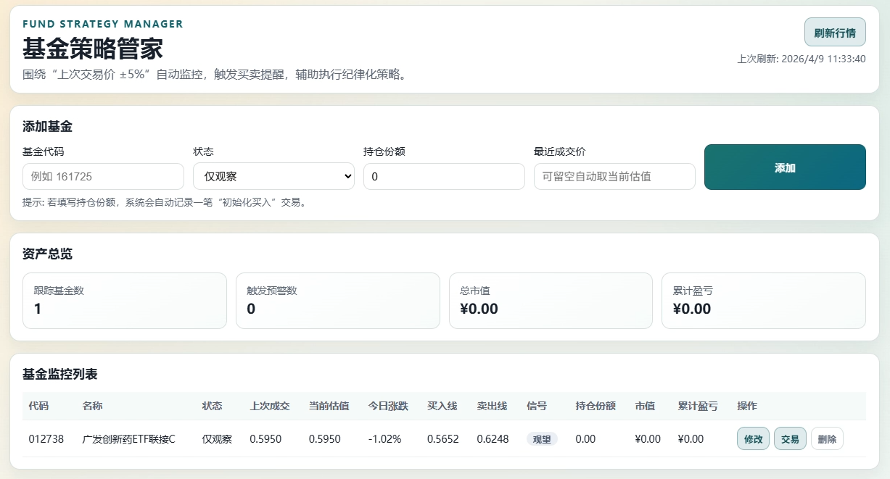


# Fund Strategy Manager

一个帮助你“严格执行低买高卖”的基金量化工具

---

## 🚀 下载

👉 点击下载最新版（Windows）：

https://github.com/GoatY010/fund-strategy-manager/releases

---

## ⚡ 快速开始

1. 下载并解压 `FundStrategyManager_v1.0.zip`
2. 双击 `FundStrategyManager.exe`
3. 添加基金代码
4. 输入持仓和最近成交价
5. 根据提示进行买入 / 卖出

---

## 🧠 核心策略

以“最近一次成交价”为基准：

* 📉 跌 5% → 买入
* 📈 涨 5% → 卖出
* 🔁 每次交易后自动更新基准价

👉 自动循环执行低买高卖策略

---

## 📊 功能

* 基金实时监控
* 自动买卖信号提示
* 持仓管理
* 收益统计

---

## 🔄 使用流程

添加基金 → 设置持仓 → 系统监控 → 触发信号 → 执行交易 → 更新价格 → 循环

---

## ⚠ 注意

如果 Windows 提示：

“Windows 已保护你的电脑”

👉 点击：
“更多信息” → “仍要运行”

---

## 📌 免责声明

本软件仅供学习与辅助决策，不构成投资建议。
